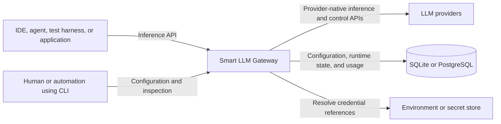
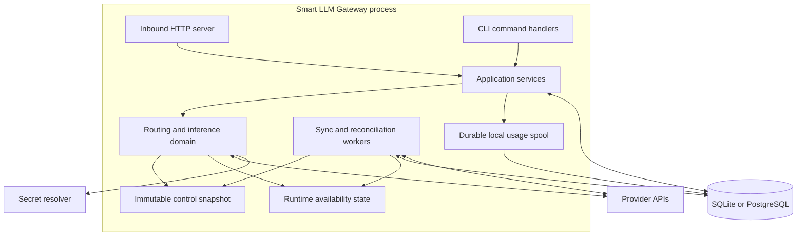
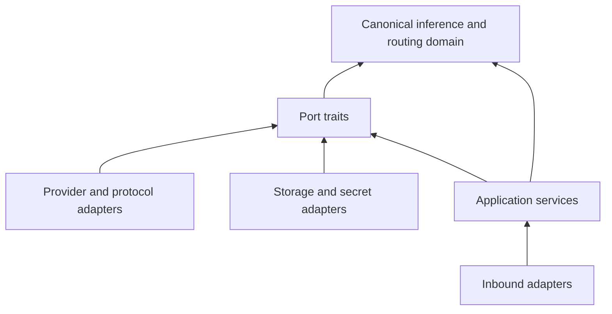
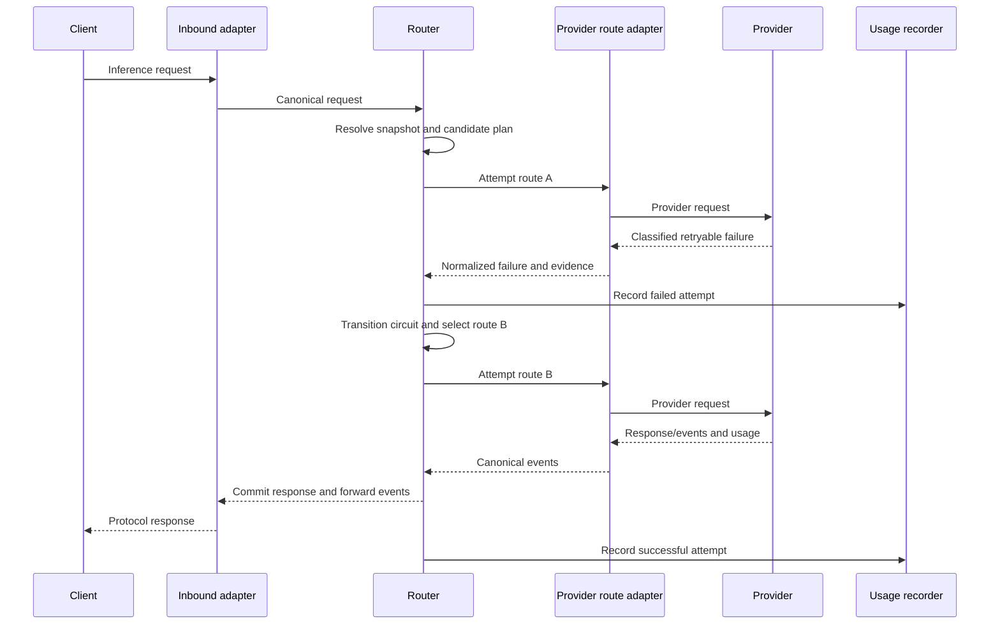
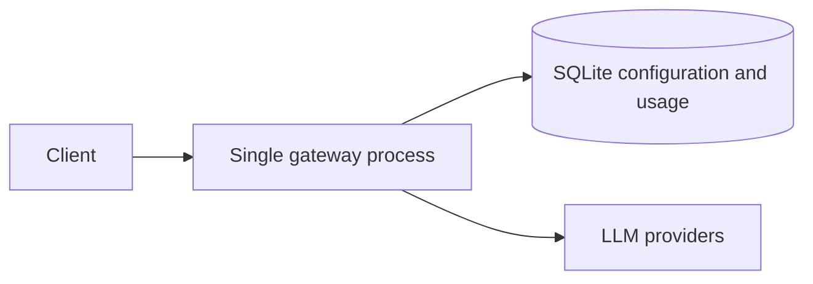
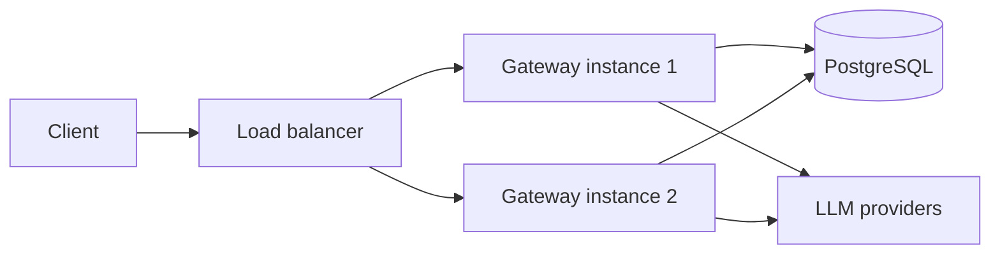
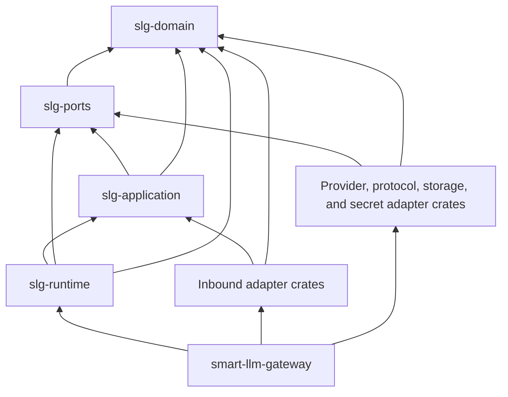

# Smart LLM Gateway Architecture

<!-- SpecDriven:managed:start -->

> **Status:** Target architecture for the first public implementation
> **Primary source:** [`PRODUCT.md`](./PRODUCT.md)
> **Last updated:** 2026-08-25

## 1. Purpose and Scope

This document defines the technical architecture of Smart LLM Gateway. It turns the product decisions in `PRODUCT.md` into implementation boundaries, runtime flows, state ownership rules, and extension contracts.

Smart LLM Gateway is a protocol-translating, multi-provider inference gateway. Clients address stable logical models through a supported public API. The gateway authenticates the request, resolves the active routing configuration, selects an eligible provider route, translates the request to the upstream protocol, and records provider-reported operational and billing evidence.

The first release exposes an OpenAI-compatible API and runs as a Rust binary with either SQLite or PostgreSQL. The architecture must permit future inbound Anthropic Messages, Google Gemini, and Alibaba Cloud Model Studio/DashScope APIs without duplicating the routing core. Neon is one supported PostgreSQL hosting option, not an architectural dependency.

This is a **pragmatic ports-and-adapters architecture implemented as a modular monolith**. The process is split into cohesive private crates inside one Cargo Workspace, but it is distributed as one binary and does not introduce network boundaries between internal components.

### 1.1 Architectural Goals

1. Keep the client-facing model identity stable while provider routes change.
2. Keep client protocols, upstream protocols, providers, and databases independently replaceable.
3. Fail over safely before client-visible output begins, without replaying an in-progress response.
4. Use authoritative provider evidence for quota, cost, cache, and failure decisions.
5. Keep routing operational during a temporary control-plane database outage.
6. Support concurrent requests and, with PostgreSQL, multiple gateway instances.
7. Remain simple to install and operate as an open-source single binary.

### 1.2 Non-Goals for the Initial Architecture

- Defining a new universal public LLM protocol.
- Hiding semantic incompatibilities by silently dropping unsupported features.
- Estimating provider balances, quota consumption, prices, cache savings, or billed cost.
- Replaying a request after response headers or streamed output have reached the client.
- Sharing provider-native cache entries across providers, accounts, routes, or models.
- General-purpose response caching of generated answers.
- Splitting the gateway into microservices.
- Depending on Neon-only database features.

## 2. Architecture Drivers

The design is shaped by five independent dimensions of change:

| Dimension | Examples | Isolation boundary |
|---|---|---|
| Client protocol | OpenAI, Anthropic Messages, Gemini, DashScope | Inbound protocol adapter |
| Upstream wire protocol | OpenAI-compatible, Anthropic, Gemini, DashScope | Upstream protocol adapter |
| Provider behavior | OpenRouter, DeepInfra, DeepSeek, Anthropic, Google, Alibaba | Provider connector |
| Persistence | SQLite, PostgreSQL, local durable spool | Repository and state-store ports |
| Provider capability | quota sync, billing reconciliation, prompt/context cache | Optional capability ports |

Provider and protocol are deliberately separate axes. A provider connector supplies provider-specific authentication, endpoint selection, error evidence, quota APIs, and billing APIs. An upstream protocol adapter supplies the wire-format translation and streaming parser. A route composes the two.

This separation avoids an adapter for every client-protocol/provider pair:

```text
inbound protocol -> canonical inference -> provider connector + upstream protocol -> provider
```

## 3. System Context



### 3.1 Trust Boundaries

- **Client boundary:** client input, gateway keys, protocol extensions, and request metadata are untrusted.
- **Provider boundary:** provider responses, headers, error payloads, usage fields, and webhook/control-plane data are externally supplied evidence and must be validated.
- **Persistence boundary:** database contents may be stale or unavailable; only validated snapshots can enter the request path.
- **Secret boundary:** provider credentials are resolved inside the process and never enter client responses, logs, usage records, or configuration exports.

## 4. Runtime Topology

The initial deployment is one executable with three modes of interaction:

- `gateway serve` runs the inference data plane and background workers.
- CLI configuration commands invoke the same application use cases in-process and persist through the same repository ports.
- Inspection commands read sanitized configuration, state, quota, cache, and usage projections.

There is no separate admin service in the initial design. A future remote administration API may call the same application use cases, but it must not bypass validation or write database tables directly.



## 5. Component Boundaries

### 5.1 Inbound Protocol Adapters

Inbound adapters own the public HTTP contract for one client protocol. They:

- parse and validate the public request;
- translate it into a canonical inference request;
- preserve supported namespaced extensions;
- translate canonical response events and errors back to the client protocol;
- enforce protocol-specific streaming framing and disconnect behavior.

They do not select providers, query quota state, implement fallbacks, or access database tables.

The first adapter implements the supported OpenAI-compatible surface, beginning with `/v1/chat/completions`. Compatibility is versioned by tested behavior, not claimed for endpoints or fields the gateway does not implement.

### 5.2 Application Services

Application services coordinate use cases without containing provider wire logic. Initial services include:

- inference execution;
- gateway-key authentication;
- preset, grade, logical-model, route, and fallback management;
- schedule evaluation and manual override;
- provider synchronization;
- quota, route, cache, and usage inspection;
- billing reconciliation;
- configuration snapshot publication.

CLI handlers and future administrative transports call these services. This prevents a second set of validation rules from emerging in the CLI.

### 5.3 Canonical Inference Core

The core owns protocol-neutral inference semantics and routing policy. It depends on ports, not concrete HTTP clients or databases.

Core responsibilities:

- resolve the requested grade or logical model;
- build a finite ordered candidate plan;
- negotiate required capabilities;
- evaluate account, route, and authoritative quota eligibility;
- execute attempts through the selected outbound composition;
- classify the retry/fallback decision from normalized failures;
- enforce the response commitment boundary;
- emit immutable attempt facts and state-transition commands.

### 5.4 Provider Connectors

A provider connector owns behavior that varies by provider or provider account:

- base URL and regional endpoint resolution;
- credential placement and provider-specific authentication;
- provider headers, organization/project identifiers, and request IDs;
- discovery of provider-supported upstream protocols;
- structured error-evidence extraction and classification rules;
- authoritative quota, plan, balance, and reset synchronization when available;
- billing/usage reconciliation when available;
- provider-native cache lifecycle APIs when available;
- capability declarations that are more specific than the wire protocol.

A connector must never infer remaining quota or billed cost from a local pricing table.

### 5.5 Upstream Protocol Adapters

An upstream protocol adapter owns wire semantics shared by one or more providers:

- canonical request to provider payload translation;
- provider response to canonical event translation;
- streaming and non-streaming decoding;
- finish-reason and usage normalization;
- protocol-level capability constraints;
- safe extraction of structured protocol errors.

Provider connectors may add evidence or override documented provider-specific classifications, but they do not reimplement the entire protocol codec.

### 5.6 Persistence Adapters

SQLite and PostgreSQL adapters implement the same repository contracts and externally visible behavior. They own dialect-specific SQL, migrations, transactions, and concurrency primitives.

The domain must not depend on:

- SQL syntax;
- database-generated identifiers;
- PostgreSQL notification mechanisms;
- Neon-specific branching, serverless, or proxy features;
- SQLite-only locking behavior.

### 5.7 Secret Resolvers

Configuration stores a secret reference, never the provider credential itself unless an explicitly selected secret backend is designed to encrypt it. The initial resolver supports environment-backed references. Additional resolvers can implement the same port.

Resolved secrets are short-lived in memory, redacted from diagnostics, and excluded from snapshots written to disk.

### 5.8 Background Workers

Workers perform operations that must not add latency to the inference critical path:

- authoritative provider quota and balance synchronization;
- provider billing reconciliation;
- usage spool delivery;
- snapshot refresh and validation;
- circuit state propagation and cleanup;
- provider cache-resource expiry cleanup.

Workers use bounded concurrency, jittered schedules, and cancellation. A failed worker must degrade only its capability; it must not terminate the inference server.

### 5.9 Port Catalog

The initial port set should remain small and responsibility-oriented:

| Port | Purpose |
|---|---|
| Inference route | Execute one canonical request on one already-selected provider route |
| Configuration repository | Read and transactionally mutate presets, models, routes, fallbacks, schedules, and policies |
| Runtime state repository | Persist account/route transitions and coordinate half-open leases |
| Usage repository | Append attempts and apply idempotent billing reconciliation |
| Quota source | Fetch authoritative provider quota, plan, balance, and reset facts |
| Billing source | Fetch provider-authoritative charges or billed-unit records |
| Provider cache | Create, resolve, and expire provider-native cache resources |
| Secret resolver | Resolve a configured credential reference at execution time |
| Snapshot store | Persist and load a validated last-known-good snapshot |
| Usage spool | Durably queue attempt records when the primary store is unavailable |

Optional provider capabilities are discovered explicitly. The absence of a quota, billing, or cache port is a supported state, not an adapter failure.

## 6. Dependency Rule

Dependencies point inward. The domain crate contains no dependencies on inbound transports, provider SDKs, SQL drivers, asynchronous runtimes, or secret backends.



Ports are expressed as traits only at real variability or side-effect boundaries. Pure internal helpers do not receive traits solely for abstraction.

## 7. Canonical Inference Contract

The canonical contract is an internal compatibility layer, not a public standard. It is versioned with the binary and optimized for loss-aware translation.

### 7.1 Request Model

A canonical request contains at least:

- gateway request ID;
- requested public protocol and endpoint;
- requested grade or stable logical model;
- ordered messages or content blocks with typed roles and parts;
- text, image, audio, and document references when supported;
- tool definitions, tool choice, and prior tool results;
- streaming preference;
- structured-output requirements;
- sampling and output controls;
- reasoning controls when explicitly requested;
- provider-neutral cache intent;
- namespaced extensions with provenance;
- deadlines, cancellation, and safe request metadata.

The model distinguishes **required semantics** from advisory preferences. A route that cannot preserve a required semantic is ineligible. An advisory field may be translated or omitted only when the inbound compatibility contract explicitly permits it and the decision is observable.

### 7.2 Response Event Model

Both streaming and non-streaming responses are represented as an ordered event stream. Event types include:

- response started;
- content delta by typed part;
- tool-call start, argument delta, and completion;
- reasoning or provider-specific delta where exposure is permitted;
- usage update;
- response completed with normalized finish reason;
- normalized failure before commitment.

The inbound adapter may aggregate events for a non-streaming client. The core does not maintain separate routing semantics for streaming and non-streaming calls.

### 7.3 Extensions and Passthrough

Extensions are namespaced, for example by public protocol or provider. They must include enough provenance to decide whether they can be translated or forwarded.

Rules:

1. Unknown client fields are not blindly forwarded upstream.
2. Same-protocol passthrough is allowed only through an explicit allowlist or a documented lossless envelope.
3. Cross-protocol translation must preserve meaning, not merely field names.
4. Unsupported required extensions cause a clear preflight error before provider billing begins.
5. Sensitive provider fields are never copied into client-visible extensions.

### 7.4 Capability Negotiation

Every route publishes a normalized capability descriptor that combines protocol and provider facts, including:

- supported modalities;
- tool use and parallel tool calls;
- structured output modes;
- streaming event support;
- reasoning controls and visibility;
- maximum context and output limits when authoritative;
- cache modes: none, implicit prefix, explicit breakpoint, or explicit resource;
- usage fields the provider reports;
- protocol extensions the route can preserve.

Capabilities are evaluated before an attempt. If no route can meet the required request semantics, the gateway returns an unsupported-capability error rather than silently weakening the request.

## 8. Request Lifecycle

### 8.1 Pre-Attempt Flow

1. The inbound adapter parses the request and assigns or accepts a safe gateway request ID.
2. Authentication validates the gateway key against the local authentication cache.
3. The application captures one immutable control snapshot for the request.
4. Preset resolution applies manual override, then schedules, then the configured default.
5. A grade, if requested, resolves to one stable logical model.
6. The router expands the logical model and its fallback chain into an ordered, cycle-free candidate plan.
7. Capability negotiation removes incompatible routes.
8. Availability and authoritative quota policy remove currently ineligible routes.
9. The router begins the first eligible attempt.

The request keeps its captured snapshot for deterministic routing. A configuration update affects new requests, not an in-flight request. Immediate runtime failures discovered by the same request are still applied to its remaining candidates.

### 8.2 Attempt and Fallback Flow



### 8.3 Response Commitment Boundary

The router may retry or fall back only while the response is uncommitted. The response becomes committed when either:

- response headers are sent to the client; or
- the first streamed output event is forwarded.

Before commitment, the gateway may discard an upstream partial response that has not been exposed and try another eligible route. After commitment:

- the request stays on the selected route;
- an upstream failure is translated into the best protocol-valid terminal signal;
- the gateway records the partial outcome;
- no silent replay occurs, even if a fallback exists.

Client cancellation propagates to the active provider request. Cancellation is not treated as a provider health failure unless independent provider evidence warrants it.

## 9. Routing Model

### 9.1 Stable Identity and Candidate Ordering

The public model name identifies a `logical_model`, not an upstream deployment. A preset supplies ordered provider routes and ordered cross-model fallbacks.

Candidate ordering is deterministic:

```text
requested grade, if present
  -> preset grade mapping
  -> source logical model
     -> provider routes by priority
  -> fallback logical models by priority
     -> each fallback's provider routes by priority
```

Fallback expansion rejects cycles during configuration validation and enforces a finite maximum depth as a defensive runtime guard.

The initial router is priority-based. Latency-, price-, or quality-weighted routing can be added later as explicit policies, but the MVP does not infer cost or reorder routes from guessed economics.

### 9.2 Route Eligibility

A route is eligible only when all of the following are true:

1. the preset, logical model, provider account, and route are enabled;
2. the route satisfies required capabilities;
3. the provider account is not `blocked`;
4. the route circuit is `closed`, or the request owns the allowed `half_open` probe;
5. no fresh authoritative quota fact has crossed the configured switching threshold;
6. the request has not already attempted the same effective route;
7. the request deadline leaves enough time for another attempt.

An account in `unknown` state is eligible. The gateway does not require a successful quota poll before allowing traffic.

### 9.3 Attempt Budget

The candidate plan is bounded by:

- the finite configured route/fallback graph;
- one attempt per effective candidate unless a provider explicitly documents a safe transport retry;
- the client deadline;
- an operator-configurable maximum attempt count.

Transport retries and route fallbacks are distinct. A transport retry stays on the same route for failures known to be safe and idempotent before provider acceptance. A fallback selects a different route or logical model and creates a new usage attempt.

## 10. Availability State and Circuit Breakers

The gateway persists mutable availability at exactly two levels.

### 10.1 Provider Account State

| State | Meaning | Eligibility |
|---|---|---|
| `unknown` | No authoritative availability conclusion | Eligible |
| `available` | Recent provider evidence indicates the account is usable | Eligible |
| `blocked` | Account-scoped quota, credit, spend, auth, or policy evidence prevents use | Ineligible |

Account state affects every route sharing the credential/account. State includes the normalized reason, sanitized evidence, observation time, and `retry_at` when known.

### 10.2 Provider Route State

| State | Meaning | Eligibility |
|---|---|---|
| `closed` | Normal operation | Eligible |
| `open` | Route is temporarily or administratively unavailable | Ineligible |
| `half_open` | One recovery request may probe the route | Lease holder only |

Logical-model availability is always derived from eligible routes and is never persisted as another mutable state.

### 10.3 Normalized Error Contract

Every failed attempt produces a normalized error with:

- `category`: `quota_exhausted`, `credit_exhausted`, `spend_limit_exceeded`, `rate_limited`, `concurrency_limited`, `authentication_failed`, `model_unavailable`, `provider_unavailable`, or `unknown`;
- `scope`: provider account, credential, route, upstream model, or logical model;
- `retry_class`: `after_reset`, `after_delay`, `after_configuration_change`, `immediate_fallback`, or `not_retryable`;
- `retry_at`, when authoritative;
- provider code, HTTP status, provider request ID, and sanitized evidence;
- classification rule/version used.

Classification precedence is:

1. structured provider error code;
2. documented standardized or provider headers;
3. documented structured response fields;
4. stable provider-specific message pattern as a last resort.

An unknown `429` is a short-lived rate-limit event. It is never promoted to quota exhaustion without evidence.

### 10.4 Transition Policy

- Confirmed account quota, credit, or spend exhaustion blocks the account on the first failure.
- Confirmed route/model exhaustion or unavailability opens only the affected route.
- Rate and concurrency limits open the route until `Retry-After`, a reset header, or a conservative provider-specific cooldown.
- Timeouts, connection failures, overload, and eligible `5xx` failures use a configurable rolling threshold.
- Authentication failures block the relevant credential/account until configuration changes or authoritative recovery is observed.
- Unknown failures are recorded but do not create a permanent block.

An error scoped to an upstream or logical model never creates a third model-state record. It opens the observed route; only explicit provider evidence that the same failure applies to sibling routes may transition those routes as well.

At `retry_at`, a route may transition to `half_open`. One real client request receives the probe lease. Success closes the route; a classified failure renews the open/block period. Synthetic inference probes are not generated.

With PostgreSQL, the probe lease and state transition use an atomic database operation so only one gateway instance owns the cluster-wide half-open probe. With SQLite, the same contract is enforced within the single local deployment. If PostgreSQL is unavailable, each instance remains conservative using its local state and does not claim cluster-wide coordination.

## 11. Quota and Balance Architecture

Quota awareness has two evidence paths.

### 11.1 Authoritative Proactive Path

If the provider exposes an authenticated plan, quota, balance, usage, or reset API, a provider capability synchronizes immutable snapshots containing:

- provider account and constraint identity;
- unit type, such as requests, tokens, or currency;
- allowance, consumed, and remaining values as reported;
- reset semantics and timestamp;
- observation time and freshness;
- raw provider source identifier and sanitized evidence version.

The routing policy may make a route ineligible when fresh authoritative remaining capacity is **5% or less**. The threshold is configurable, but the gateway never reconstructs the provider fact itself.

Percentage switching requires an authoritative denominator or limit. A standalone monetary balance without an authoritative limit is not converted into a percentage; it remains eligible until the provider supplies a usable threshold/reset signal or a classified exhaustion error occurs.

Stale data is not silently treated as current. Policy decides whether stale authoritative data is ignored, triggers an immediate refresh, or causes conservative avoidance when another eligible route exists.

### 11.2 Reactive Path

When no authoritative control API exists, the route remains eligible until the provider returns a machine-classifiable error. The first confirmed quota/credit/spend failure changes the appropriate state and triggers a safe fallback within the same client request when possible.

Local request and token counters may be retained for reporting, but they never masquerade as remaining provider quota and never drive quota exhaustion decisions.

## 12. Provider-Native Caching

Caching is a capability of the selected upstream route, not of the logical model in isolation.

### 12.1 Cache Intent

The canonical request can express protocol-neutral intent such as:

- allow provider implicit prefix caching;
- request an explicit cache breakpoint;
- reference or create an explicit context resource;
- require caching or merely prefer it;
- desired provider-reported time-to-live when supported.

The route adapter maps that intent to one of four normalized modes:

| Mode | Meaning |
|---|---|
| `none` | Route provides no supported cache behavior |
| `implicit_prefix` | Provider automatically recognizes reusable prefixes |
| `explicit_breakpoint` | Request marks provider-supported cache boundaries |
| `explicit_resource` | Provider creates and later references a cache resource |

Required cache semantics participate in capability negotiation. Preferred cache semantics may proceed without caching only when the client contract allows it and the outcome remains observable.

### 12.2 Cache Ownership

Provider-native cache identifiers are scoped by:

- provider account;
- provider route;
- upstream model and compatible version;
- provider region or endpoint when relevant;
- expiry and lifecycle state.

A fallback route never reuses another route's cache identifier. The gateway does not persist raw prompt content by default. It stores only opaque provider resource identifiers, safe scope metadata, expiry, and provider-reported cache accounting.

### 12.3 Cache Accounting

Usage records distinguish provider-reported cache writes, cache reads, cached input tokens, and charges when the provider reports them. The gateway reports no cache hit or savings without provider evidence.

Gateway response caching is outside the initial architecture. If introduced, it requires a separate opt-in policy, content isolation, deterministic-key rules, privacy controls, and correctness analysis.

## 13. Data Architecture

### 13.1 Logical Data Groups

| Group | Entities | Ownership |
|---|---|---|
| Authentication | `gateway_keys` | Gateway-key application service |
| Routing configuration | `presets`, `logical_models`, `preset_grade_mappings`, `provider_accounts`, `provider_routes`, `model_fallbacks`, `schedules` | Configuration application service |
| Quota policy | `provider_quota_snapshots`, `quota_routing_policies` | Provider sync and routing policy |
| Failure interpretation | `provider_error_mappings` | Provider connector registry |
| Runtime availability | `provider_account_state`, `provider_route_state` | Runtime state service |
| Usage and cost | `usage_attempts` | Usage recorder and reconciler |
| Provider cache | `provider_cache_entries`, `cache_policies` | Cache capability service |

### 13.2 Data Invariants

- Logical model names are globally unique and stable.
- A grade maps at most once inside a preset.
- Route priority is unique per preset and logical model.
- Fallback priority is unique per preset and source logical model.
- Fallback graphs are acyclic and finite.
- Provider routes reference a valid provider account, connector, and upstream protocol.
- Usage attempts have globally unique application-generated IDs.
- Completed attempt facts are append-only; only explicit reconciliation fields may change.
- Money uses fixed-precision decimals and always includes currency.
- Quota snapshots contain provider-authoritative values only and retain observation/freshness metadata.
- Logical-model availability is derived, never stored.
- Cache resources never cross provider-account/route/model scope.
- Secret values do not appear in configuration, state, usage, quota, or cache tables.

### 13.3 Configuration Revisions

Every routing-affecting mutation increments a monotonic configuration revision in the same transaction. A snapshot builder reads one consistent revision, validates the entire routing graph, compiles lookup maps, and publishes it atomically in memory.

Invalid configuration is rejected before publication. The currently active snapshot remains in service if a later revision cannot be loaded or validated.

PostgreSQL deployments may use notifications as an optimization, but correctness relies on revision polling. SQLite and PostgreSQL therefore share the same behavior.

### 13.4 Transactions and Concurrency

Repository operations expose domain-level transactions rather than generic database handles. Required atomic operations include:

- activate a preset or manual override;
- replace a logical model's ordered routes;
- replace and validate a fallback chain;
- publish a provider-account state transition;
- acquire or release a half-open probe lease;
- append an attempt or idempotently reconcile its billing fields;
- create, expire, or delete a provider cache-resource reference.

Optimistic version checks prevent lost updates. PostgreSQL adapters use database transactions and row/version predicates. SQLite adapters use transactions appropriate to its single-node concurrency model while preserving the same repository contract.

### 13.5 Migration Portability

SQLite and PostgreSQL have separate dialect-aware migration sets with the same logical schema version. Migration tests create each database from zero and upgrade from every supported release boundary.

Application-generated identifiers and normalized UTC timestamps avoid backend-specific identity and time behavior. Database constraints enforce core uniqueness and referential integrity in both backends.

## 14. Control Snapshots and Database Degradation

The request path reads immutable in-memory structures and does not query the configuration database for each routing decision.

### 14.1 Snapshot Contents

A validated snapshot contains:

- enabled gateway-key verification material;
- active/default/manual preset state;
- compiled schedules;
- grade mappings;
- logical models, ordered routes, and fallback graph;
- route capability descriptors;
- quota routing policies and fresh authoritative snapshots;
- sanitized provider account references;
- configuration revision and creation time.

Fast-changing circuit state is maintained in a dedicated concurrent runtime-state view and propagated more aggressively than the general configuration snapshot.

### 14.2 Refresh

- Configuration snapshots target a maximum normal staleness of 30 seconds.
- Local successful mutations trigger immediate rebuild.
- Remote revisions are discovered by polling; PostgreSQL notifications may reduce latency.
- Runtime account/route transitions update the local view immediately and are persisted/propagated separately.

### 14.3 Last-Known-Good Behavior

Each successful snapshot is serialized locally without raw gateway keys or provider credentials. It may contain the gateway-key verification representation required to continue authentication, so the file is still sensitive and must use owner-only filesystem permissions. If a remote PostgreSQL database becomes unavailable:

1. the process continues serving from the in-memory snapshot;
2. after restart, it may load the validated local last-known-good snapshot;
3. local circuit evidence continues to protect the process;
4. control-plane mutations and authoritative refreshes report unavailable status;
5. usage attempts enter the durable local spool.

A brand-new installation with neither a reachable database nor a valid snapshot fails closed unless an explicit static emergency route is configured.

## 15. Usage, Cost, and Reconciliation

Every provider attempt creates an immutable attempt identity separate from the client request identity. A request can therefore have several failed attempts followed by one successful attempt.

Attempt facts include:

- requested and resolved logical identity;
- actual provider account, route, upstream protocol, and upstream model;
- start/end time and latency;
- outcome and normalized failure evidence;
- whether the response became client-visible;
- fallback position and circuit transition;
- provider request ID;
- provider-reported request, token, cached-token, reasoning-token, or other billed units;
- provider-reported charge and currency;
- cost status: `provider_reported`, `reconciled`, or `unknown`.

No local price multiplication changes `unknown` into a billed amount.

### 15.1 Durable Local Spool

When the primary store is unavailable, completed attempt events are written to a dedicated local SQLite spool. Delivery is at least once; the primary database deduplicates by attempt ID. Records are removed from the spool only after acknowledged persistence.

The spool contains operational metadata and provider-reported accounting, not prompt or response bodies. Capacity limits and disk-full behavior are explicit: inference may continue while emitting a high-severity observability signal, but the gateway must never claim complete accounting after a spool write failure.

### 15.2 Reconciliation

For providers with billing or usage exports, a reconciler matches provider records using provider request IDs, account, model, and time window. Reconciliation is idempotent and can update only the designated billing fields, status, source reference, and reconciliation timestamp.

## 16. Security Architecture

### 16.1 Client Authentication

Gateway keys are opaque credentials. The recoverable raw value is shown only at creation when possible. Persistence stores a verification representation rather than plaintext. Authentication results may be cached briefly, but revocation must propagate within the configured snapshot window or faster.

Authentication comparisons avoid timing leaks. Logs and metrics use key IDs, never key values.

### 16.2 Provider Credentials

- Provider accounts store credential references.
- Resolvers return credentials only to the provider connector that needs them.
- Credentials are redacted structurally, not through best-effort string replacement alone.
- Configuration export, route inspection, errors, traces, and usage records omit credentials.
- Credential rotation invalidates the affected local secret cache and reevaluates blocked authentication state.

### 16.3 Network Security

- Local development may bind to loopback without TLS.
- Remote deployments require TLS at the gateway or a trusted reverse proxy.
- Administrative database credentials must have only the permissions required by the selected operation.
- Outbound redirects are disabled or strictly validated to prevent credential forwarding to an unexpected host.
- Provider base URL overrides are privileged configuration and validated against SSRF-sensitive destinations.

### 16.4 Content and Metadata Privacy

Raw prompts and generated content are not persisted by default. Structured logs, traces, error evidence, and provider fixtures are sanitized. Diagnostic content capture, if added, must be explicit, bounded, encrypted where appropriate, and governed by retention controls.

Provider extensions are allowlisted so a client cannot smuggle privileged headers, credentials, or arbitrary provider parameters through passthrough fields.

## 17. Observability

Observability is a runtime contract independent of a particular telemetry vendor.

### 17.1 Correlation

Every request carries:

- gateway request ID;
- one attempt ID per upstream call;
- provider request ID when supplied;
- logical model and actual route identifiers;
- configuration revision.

IDs are returned or logged according to the public protocol without exposing sensitive upstream details.

### 17.2 Logs

Structured logs cover:

- request acceptance and terminal outcome;
- route selection and fallback reason;
- state transitions and classification evidence version;
- snapshot publication/failure;
- quota sync and reconciliation status;
- usage spool backlog and delivery;
- provider cache-resource lifecycle.

Prompt bodies, response bodies, gateway keys, and provider secrets are excluded by default.

### 17.3 Metrics

Core metrics include:

- request and attempt counts by outcome;
- gateway-added routing latency;
- provider time to first token and total latency;
- fallback depth and exhaustion;
- circuit state transitions;
- authoritative quota freshness and remaining ratio where available;
- provider-reported billed units and charges;
- provider-reported cache reads/writes;
- snapshot age and refresh failures;
- usage spool depth and oldest record age.

Labels use bounded identifiers. Raw model strings, request IDs, error messages, and customer-controlled values are not metric labels.

### 17.4 Tracing

Tracing, when enabled, models the inbound request, routing decision, and each provider attempt as separate spans. Content is excluded. Trace export failure never blocks inference.

## 18. Performance and Concurrency

The control path targets less than 1.5 ms of gateway-added latency under cache-hit conditions, excluding provider time and durable usage persistence.

Design consequences:

- immutable snapshots use atomic publication and lock-free reads where practical;
- route maps, grade mappings, and fallback plans are precompiled;
- authentication verification results are cached for a short bounded period;
- circuit transitions use narrow per-account or per-route synchronization;
- database and billing work is outside the response critical path;
- HTTP clients reuse connections and maintain provider-specific transport pools;
- streaming uses bounded buffers and propagates backpressure;
- background work uses bounded queues and concurrency.

The gateway does not buffer an entire streaming response merely to preserve fallback. It buffers only enough to determine whether the response can be committed according to the upstream protocol. Slow-client backpressure must not create an unbounded memory queue.

## 19. Deployment Modes

### 19.1 Local SQLite



- Default for first-run and developer installations.
- One self-contained database file.
- One active gateway process per database is the supported baseline.
- Local last-known-good and usage spool paths are colocated under the gateway data directory.

### 19.2 Shared PostgreSQL



- Supports multiple machines or VMs sharing configuration and runtime state.
- Each instance has its own in-memory snapshot, last-known-good file, and durable local usage spool.
- PostgreSQL coordinates configuration revisions, state transitions, and half-open probe leases.
- Neon is configured through a standard PostgreSQL connection string with SSL; product behavior remains portable to other PostgreSQL hosts.

### 19.3 Process Startup and Shutdown

Startup proceeds in dependency order:

1. load process configuration and initialize structured diagnostics;
2. open the selected primary database and verify schema compatibility;
3. build and validate the current control snapshot, or load a valid last-known-good snapshot under the documented degradation rules;
4. initialize secret resolution, provider transports, runtime state, and the local usage spool;
5. start background workers;
6. mark the process ready and begin accepting inference traffic.

Versioned schema migrations are applied by explicit initialization or upgrade commands. The server does not serve against an incompatible schema.

On shutdown, the server stops accepting new requests, gives active requests a bounded drain period, stops workers, persists the latest safe local state, and closes transports and databases. After the drain deadline, cancellation propagates to remaining provider calls; they are never replayed during shutdown.

## 20. Initial Rust Workspace Structure

The repository uses a virtual Cargo Workspace. Internal crates set `publish = false`, share one `Cargo.lock`, and inherit common dependency versions, lints, package metadata, and build profiles from the workspace root. Only the final executable is a distribution artifact.

```text
Cargo.toml                              virtual workspace manifest
Cargo.lock                              single committed dependency lockfile
rust-toolchain.toml                     pinned toolchain under the stable/MSRV policy
crates/
  slg-domain/                           canonical types and pure domain rules
  slg-ports/                            traits for external variability and side effects
  slg-application/                      use cases and orchestration
  slg-adapter-inbound-openai/           initial public protocol
  slg-adapter-upstream-openai/          OpenAI-compatible upstream codec
  slg-adapter-provider/                 provider-specific connectors
  slg-adapter-storage-sqlite/           SQLite repositories and migrations
  slg-adapter-storage-postgres/         PostgreSQL repositories and migrations
  slg-adapter-secrets/                  environment and future secret resolvers
  slg-runtime/                          snapshots, workers, and server lifecycle
  smart-llm-gateway/                    CLI, composition root, and binary target
```

### 20.1 Crate Dependency Graph



The internal dependency graph must remain acyclic. `slg-domain` contains no async runtime, HTTP, SQL, CLI, or provider dependencies. `slg-ports` owns boundary traits and depends only on domain types. Adapters implement those traits and never become dependencies of the domain or application crates.

The official binary includes both SQLite and PostgreSQL adapters so database selection remains a runtime choice. Cargo features may support specialized builds later, but must not create different product semantics.

Crates are created only for real architectural boundaries. Future Anthropic, Gemini, or DashScope adapter crates are added when implementation begins, not as empty scaffolding. Provider connectors may remain modules inside `slg-adapter-provider` until independent release cadence, dependency isolation, or ownership makes a separate crate worthwhile.

## 21. Extension Procedures

### 21.1 Add an Inbound Protocol

1. Implement parsing and validation for the public protocol.
2. Map supported semantics to the canonical request.
3. Map canonical events and normalized errors to the protocol response.
4. Declare unsupported semantics explicitly.
5. Add compatibility fixtures and end-to-end tests without modifying routing logic.

### 21.2 Add an Upstream Protocol

1. Implement canonical request encoding and response/event decoding.
2. Publish protocol-level capabilities.
3. Extract structured protocol error evidence.
4. Verify the response commitment point and cancellation behavior.
5. Register the adapter for provider connectors that support it.

### 21.3 Add a Provider

1. Implement endpoint and authentication behavior.
2. Select an existing upstream protocol adapter or add a new one separately.
3. Declare provider-specific route capabilities.
4. Implement documented error mappings with sanitized fixtures.
5. Optionally implement authoritative quota, billing, or cache capability ports.
6. Verify that unavailable optional capabilities degrade to reactive behavior or `unknown`, never estimates.

### 21.4 Add a Database Backend

1. Implement the repository and transaction ports.
2. Provide dialect-specific migrations matching the logical schema version.
3. Pass the shared storage contract suite.
4. Demonstrate equivalent revision, lease, and idempotency behavior.

## 22. Failure Modes and Expected Behavior

| Failure | Expected behavior |
|---|---|
| Provider fails before commitment | Classify, update state, record attempt, and try next eligible candidate |
| Provider fails after commitment | End/abort according to client protocol; record partial outcome; do not replay |
| Unknown provider `429` | Short conservative rate-limit circuit; do not label quota exhaustion |
| Confirmed account credit exhaustion | Block account immediately and skip all of its routes |
| Quota API unavailable | Mark snapshot stale; retain reactive routing without estimates |
| Primary PostgreSQL unavailable | Serve last-known-good snapshot; use local state and spool; reject control mutations |
| Invalid new configuration | Reject publication and retain current snapshot |
| Usage persistence unavailable | Append to local spool and retry idempotently |
| Secret cannot be resolved | Treat account/credential as unusable; do not leak resolver details |
| Requested feature unsupported everywhere | Reject before an upstream attempt with a clear capability error |
| Client disconnects | Cancel active provider call; do not count as provider health failure by itself |
| Cache resource expired or route changes | Treat as cache miss/unsupported for that route; never reuse across scope |

## 23. Architectural Decisions

| Decision | Rationale | Consequence |
|---|---|---|
| Rust Cargo Workspace with private crates | Makes architectural boundaries compile-time visible without publishing an internal SDK surface | Workspace crates set `publish = false`, share policy, and compose into one binary |
| Modular monolith and single binary | Simplifies installation and operations while preserving internal boundaries | Components share a process; boundaries are enforced by crates and dependency rules |
| Pragmatic ports and adapters | The system has real variability at protocols, providers, storage, secrets, and cache capabilities | Avoid traits around stable pure logic |
| Canonical internal inference contract | Routing must be independent of public and upstream protocols | Translation loss must be detected and exposed |
| Provider and protocol as separate axes | Many providers share protocols and some providers expose several protocols | Routes compose a connector with a protocol adapter |
| Stable logical model identity | Clients should not change when upstream routing changes | Responses and usage retain both logical and actual identities |
| Ordered deterministic routing first | Easy to reason about, test, and operate | Dynamic optimization policies remain future work |
| Two-level mutable availability state | Prevents contradictory provider, route, and logical-model state | Logical-model availability is derived |
| Authoritative quota data or reactive errors only | Provider billing models differ and estimates can misroute traffic | Unknown remains unknown; first classified exhaustion triggers failover |
| Response commitment boundary | Prevents duplicated output and charges | Failover is unavailable after headers/first output |
| Provider-reported billing only | Local price tables cannot prove actual charges | Missing cost remains `unknown` |
| Provider-native caching first | Reduces upstream work without redefining answer correctness | Cache artifacts remain route-scoped; response caching is excluded |
| SQLite and PostgreSQL parity | Enables local and shared deployments | Migrations and contract tests must cover both backends |
| Immutable snapshots plus local LKG | Removes database reads from the hot path and tolerates remote DB outages | Configuration changes are revisioned and eventually visible within a bounded window |
| Local durable usage spool | Remote persistence failures must not silently lose accounting | Delivery is asynchronous and idempotent |

## 24. Architecture Invariants

These rules must remain true as the implementation evolves:

1. A public logical model never embeds provider selection in its identity.
2. Routing domain code never depends on a public client protocol.
3. Provider connectors and upstream protocols remain independently composable.
4. No required request semantic is silently discarded.
5. No quota, billed cost, or cache saving is presented as authoritative without provider evidence.
6. Fallback never occurs after the response commitment boundary.
7. Logical-model runtime availability is derived, not persisted.
8. Provider credentials never cross the client or observability boundary.
9. SQLite and PostgreSQL expose the same product behavior.
10. Neon-specific functionality is optional and cannot become required for correctness.
11. Raw prompt and response content is not persisted by default.
12. Every upstream call has its own immutable attempt record.

## 25. Evolution Path

The architecture supports incremental delivery:

1. **Foundation:** Rust Cargo Workspace, private core crates, gateway executable, SQLite, migrations, CLI, configuration snapshots, and gateway-key authentication.
2. **OpenAI-compatible vertical slice:** inbound and upstream OpenAI-compatible adapters, one provider connector, stable logical models, and usage attempts.
3. **Resilience:** ordered provider routes, model fallbacks, normalized errors, circuit breakers, and safe streaming commitment.
4. **Shared operation:** PostgreSQL, multi-instance state coordination, last-known-good snapshots, and durable usage spool.
5. **Provider control plane:** authoritative quota sync, cost reconciliation, and provider-native caching capabilities.
6. **Protocol expansion:** Anthropic Messages, Gemini, and DashScope inbound/upstream adapters as demanded, without changing routing or persistence domain logic.

Each stage must preserve the architecture invariants. A feature that requires breaking one must be recorded as an explicit architecture decision before implementation.

## 26. Glossary

| Term | Definition |
|---|---|
| Logical model | Stable client-facing model identity independent of provider |
| Provider account | Provider identity plus credential reference and account-scoped state |
| Provider route | Ordered mapping from a logical model to a provider account, upstream protocol, endpoint, and upstream model |
| Provider connector | Provider-specific endpoint, authentication, evidence, and control-plane behavior |
| Upstream protocol adapter | Codec and streaming behavior for an LLM wire protocol |
| Candidate plan | Finite ordered list of effective routes for one request |
| Attempt | One upstream provider call with its own outcome and accounting |
| Commitment boundary | Point after which a response cannot be safely replayed elsewhere |
| Control snapshot | Immutable validated routing/configuration view used by requests |
| Last-known-good snapshot | Local copy of the latest valid control snapshot with no raw credentials; gateway-key verification material remains protected as sensitive data |
| Authoritative evidence | A value or classification reported by, or unambiguously derived from documented structured provider data |
| Cache intent | Protocol-neutral request for provider-native cache behavior |

<!-- SpecDriven:managed:end -->
